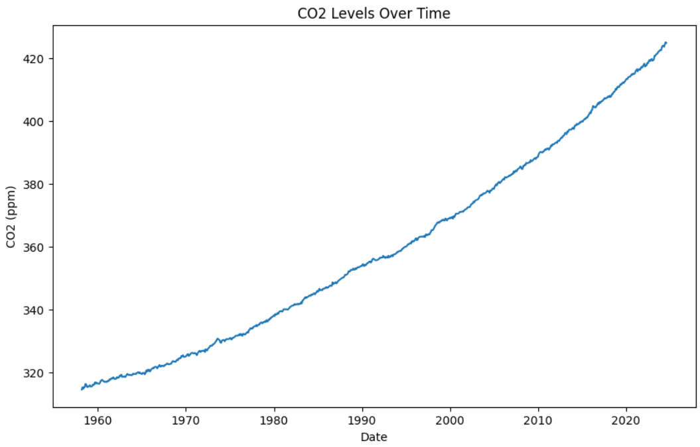
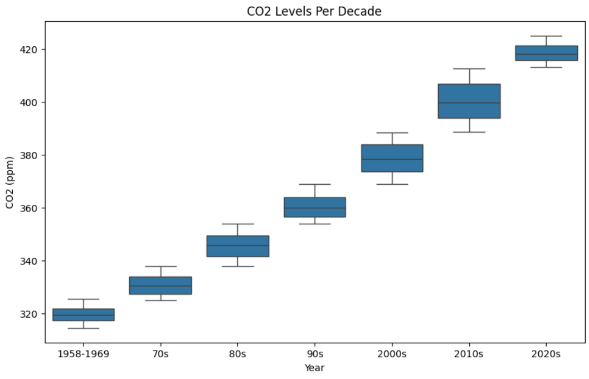

# CO2 PPM - Trends in Atmospheric Carbon Dioxide

How CO2 Level in Hawaii have increased over the years?

## Dataset Description

The dataset was gathered in Mauna Loa, Hawaii. Each month per year, new data is being added. The rows of the dataset are Date, Decimal Date, Average, Interpolated, Trend, Number of Days and __parsed_extra

## Summary of Findings

Based from the dataset, the CO2 level in Mauna Loa, Hawaii is constantly since 1958. From 315.71 in March 1958, the CO2 (PPM) have increased to 422.99 in August 2024.

## Data Preprocessing

We started by cleaning The data set by removing any rows with missing values. then, we converted the 'Date' column to a datetime format and extracted the year, month, and day into separate columns. This helps us work with the data more easily. To make the data easier to visualize, we created a new column called 'Year Group' that categorize the years into different groups (ex. 1958-1969, 70s, 80s, etc.). This helps us see trends over different time periods.

## Exploratory Data Analysis

### Visualization

The line graph shows that the CO2 levels have consistently increasing each year. This upward trend indicates a signifiicant acceleration in atmospheric CO2 concentrations that is likely driven by human activities. The sharp rise in CO2 levels poses a critical challenge for global climate stability.

The box plot shows that the CO2 levels have consistently increasing each decade starting around 320 ppm in the 1960s and surpassing 420 ppm in the 2020s.

## Model Development

We used 'Year' and 'Month' as features and 'Interpolated' as the target variable to predict CO2 levels. We split the data into two parts: one for training the model and one for testing it. We tried four different models: First, we trained each model using training data. Then, we tested how well each model worked using the test data. This helps us see which model can best predict CO2 levels based on the year and month.

## Model Evaluation

To see how well each model worked, we used three main measures: Mean Absolute Error (MAE), Mean Squared Error (MSE), and R-squared (R2). MAE tells us how close the predictions are to the actual values, MSE gives us the average squared difference between predictions and actual values, and R2 shows how well the model explains the variance in the data. We tested each model with the test data and compard their MAE, MSE, and R2 scores. This helped us see which model performed the best at predicting CO2 levels based on the year and month. 

## Conclusion

In this project, we looked at how CO2 levels in Mauna Loa, Hawaii, have changed from 1958 to 2024. We found that CO2 levels have been going up a lot, which is mostly because of human activities. The graphs we made show that CO2 levels started around 320 ppm n the 1960s and went over 420 ppm. We have used 4 models to predict future Co2 levels. The Random Forest model was the most accurate. This project highlights the need to monitor and reduce C02 levels to protect our environment.
